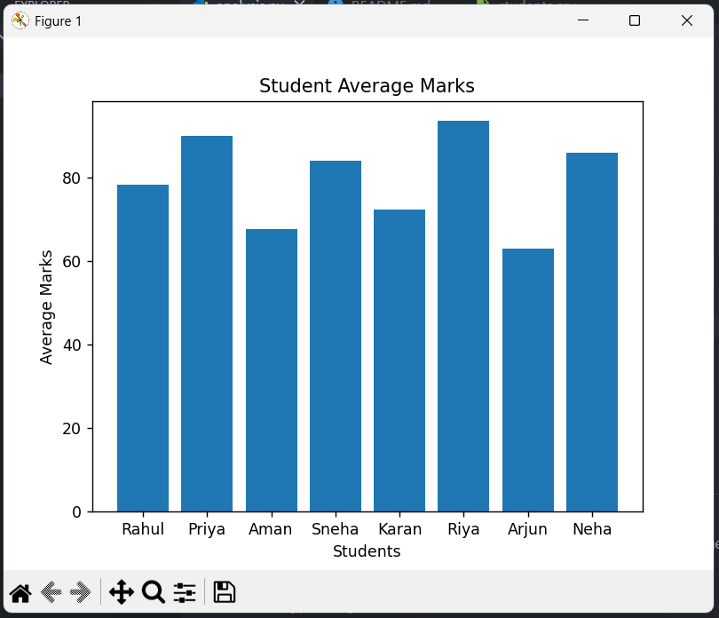

# Student Marks Data Analysis

This project analyzes student marks using Python and Pandas.

Features:
- Reads student data from CSV file
- Calculates total and average marks
- Finds class topper
- Shows statistical summary
- Sorts students by average marks
- Finds top 3 students
- Finds subject-wise toppers
- Visualizes average marks using a bar chart

Tools Used:
- Python
- Pandas
- Matplotlib

- ## Visualization

