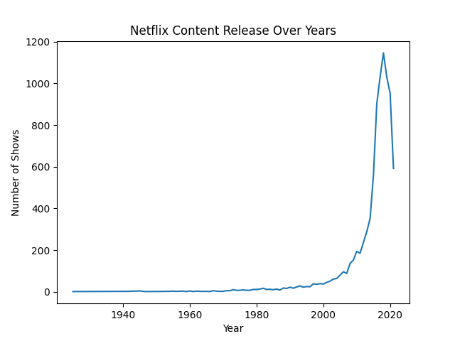

# Netflix Data Analysis

This project analyzes Netflix dataset using Python, Pandas and Matplotlib.

## Insights

- Movies vs TV Shows distribution
- Top 10 countries producing Netflix content
- Netflix content growth over the years

## Visualizations

### Movies vs TV Shows

### Top Countries Producing Netflix Content

### Netflix Content Growth
